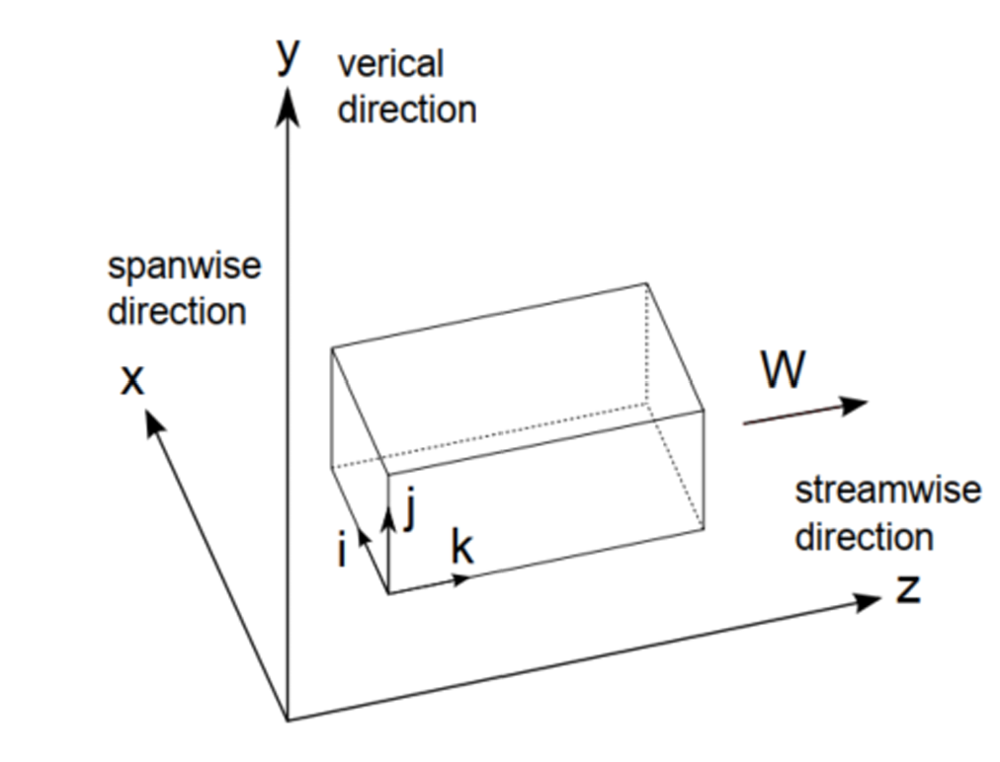

# 🚀 Pointwise Inlet Extractor

Python toolkit for extracting inlet boundary coordinates from CFD grid files. Supports massive Tecplot files (10+ GB) with parallel processing.

## ⚡ Quick Start

### **Large Files (10+ GB) - AUTOMATED:**
```bash
python extract_inlet_simple_parallel.py    # Auto-extracts inlet
python convert_inlet_coordinates_optimized.py    # Converts to xyz format
```

### **Small Files (<1 GB) - SIMPLE:**
```bash
python extract_inlet_simple.py    # Manual configuration required
python convert_inlet_coordinates.py    # Basic conversion
```

## 📋 Prerequisites
```bash
pip install numpy tqdm psutil
# Input: Tecplot ASCII (.dat) file with DATAPACKING=POINT
```

---

## 📖 Scripts Overview

| **Script** | **Use Case** | **Performance** |
|------------|--------------|-----------------|
| `extract_inlet_simple.py` | Learning, small files | Serial, requires RAM = file size |
| `extract_inlet_simple_parallel.py` | **Production, large files** | **Parallel, 1-2GB RAM** |
| `convert_inlet_coordinates.py` | Basic conversion | Serial, <100K points |
| `convert_inlet_coordinates_optimized.py` | **Large datasets** | **Memory mapping, 10-100x faster** |

### **🤖 Agent Mode** (`extract_inlet_simple_parallel.py`)
- **Fully autonomous** - no configuration needed
- **Auto-detects** grid files and optimal settings
- **Parallel processing** with all CPU cores
- **Memory efficient** - handles files larger than RAM

**Real Example:**
```
📁 Grid: grid-flood.dat (10.4 GB) → 126,049 inlet points in 5 minutes
```

### **⚡ Optimized Converter** (`convert_inlet_coordinates_optimized.py`)
- **Memory mapping** for efficient large file access
- **Vectorized parsing** with NumPy (10-100x speedup)
- **Parallel I/O** for simultaneous file operations

---

## 📁 File Formats

**Input (Tecplot):**
```
VARIABLES = "X" "Y" "Z"
I=1637, J=77, K=1637, ZONETYPE=Ordered
DATAPACKING=POINT
7.249556e+05 4.560158e+06 -2.830000e+01
```

**Output:**
- `inlet_boundary_coordinates.txt` - Extracted coordinates
- `xyz_optimized.dat` - Combined format
- `inlet_coords_x/y/z.txt/.npy` - Separate arrays

---

## 🔧 Configuration

**Basic Scripts:** Edit variables in script
```python
grid_file = "grid-flood.dat"
inlet_face = "k_min"  # Options: i_min/max, j_min/max, k_min/max
```

**Parallel Scripts:** Automatic or interactive prompts

---

## 🛠️ Troubleshooting

- **Memory Error:** Use parallel versions (`*_parallel.py`, `*_optimized.py`)
- **No inlet found:** Try different `inlet_face` (i_min, j_max, etc.)
- **File format:** Ensure Tecplot ASCII with `DATAPACKING=POINT`

---

**⭐ Recommendation: Use parallel/optimized versions for production work!**